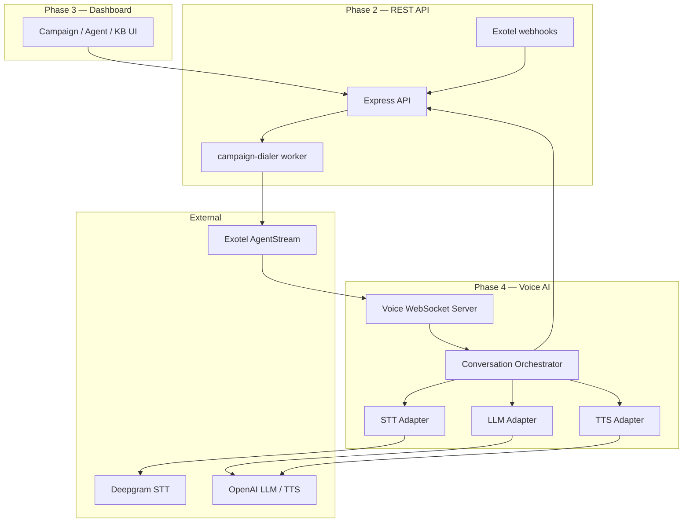
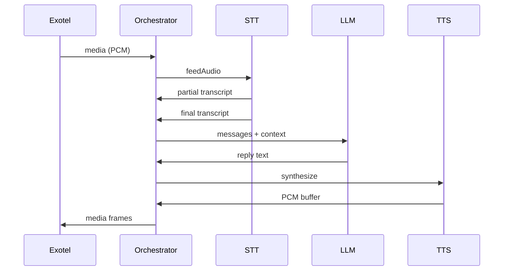
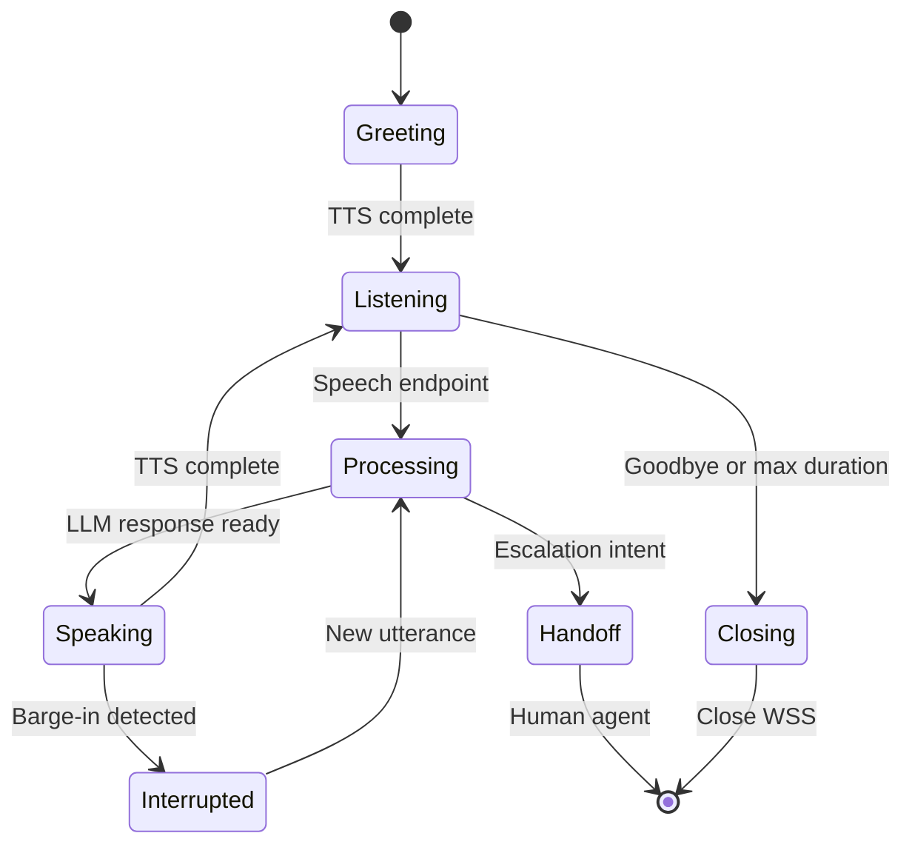

# AI Calling Features — Phase 4

Phase 4 adds the real-time voice AI pipeline **after** the CRM/dashboard foundation is working (Phases 1–3).

| Phase | Scope | Dependency |
|---|---|---|
| Phase 1 | Database layer (Prisma) | — |
| Phase 2 | Backend REST API (Express) | Phase 1 |
| Phase 3 | Frontend CRM/dashboard (Next.js) | Phase 2 |
| **Phase 4** | **Voice worker + AI calling pipeline** | **Phases 2 & 3** |

Phase 4 does **not** replace CRM or dashboard code. It extends the backend with a dedicated voice path that the dashboard triggers via campaigns and monitors via call APIs.

## Phase 4 Feature Set

| Feature | Purpose |
|---|---|
| Speech-to-Text (STT) | Convert caller audio to text in real time |
| Text-to-Speech (TTS) | Synthesize agent replies as PCM audio |
| LLM Integration | Generate contextual, KB-aware responses |
| AI Agent Logic | Load tenant agent config, prompts, and behavior |
| Call Orchestration | Manage Exotel WSS lifecycle and turn loop |
| Multi-language Support | Detect language and respond in caller's language |

## Architecture Placement



**Layer rule:** Voice AI runs in `backend/src/voice/`. REST modules (`campaigns`, `calls`, `agents`, `knowledge`) remain in `backend/src/modules/`. No business logic in controllers; orchestration stays in the voice layer and services.

---

## 1. Speech-to-Text (STT)

### Responsibility

Stream PCM audio from Exotel, produce partial and final transcripts, and signal utterance boundaries for the orchestrator.

### Adapter Interface

Defined in `conversation-orchestrator.ts`:

```typescript
interface SttAdapter {
  readonly name: string;
  start(config: SttSessionConfig): Promise<void>;
  feedAudio(chunk: Buffer): void;
  onTranscript(handler: (result: SttPartialResult) => void): void;
  stop(): Promise<void>;
}
```

### Primary Provider — Deepgram

| Setting | Value |
|---|---|
| Implementation | `backend/src/voice/adapters/stt/deepgram.adapter.ts` |
| Model | `nova-2` (default) |
| Encoding | `linear16`, mono |
| Sample rate | From Exotel `start.media_format.sample_rate` (default 8000 Hz) |
| Interim results | Enabled |
| Endpointing | 300 ms silence |

### Audio Flow

1. Exotel sends `media` frames with base64 PCM payload.
2. `exotel-protocol.ts` decodes payload to `Buffer`.
3. Orchestrator calls `stt.feedAudio(chunk)`.
4. Deepgram WebSocket returns `Results` messages.
5. Final transcript triggers `processUserUtterance()`.

### Configuration

| Env var | Required | Description |
|---|---|---|
| `DEEPGRAM_API_KEY` | Yes (prod) | Deepgram API token |

### Future Enhancements (do not break existing adapter)

- Sarvam AI adapter for Indian languages (`adapters/stt/sarvam.adapter.ts`)
- Language hint from agent config passed to `SttSessionConfig.language`
- VAD layer before STT for barge-in detection

---

## 2. Text-to-Speech (TTS)

### Responsibility

Convert LLM reply text to PCM audio and stream it back to Exotel in `media` frames.

### Adapter Interface

```typescript
interface TtsAdapter {
  readonly name: string;
  synthesize(text: string, options?: TtsSynthesisOptions): Promise<Buffer>;
}
```

### Primary Provider — OpenAI

| Setting | Value |
|---|---|
| Implementation | `backend/src/voice/adapters/tts/openai.adapter.ts` |
| Model | `gpt-4o-mini-tts` (default) |
| Output format | PCM |
| Default voice | `alloy` |

### Streaming to Exotel

The orchestrator chunks synthesized PCM (3200 bytes per frame) and sends via `buildMediaFrame()` + `serializeExotelFrame()`.

### Voice Profile (Multi-language)

Agent `voice_profile` JSONB maps language codes to provider voice IDs:

```json
{
  "en": { "provider": "openai", "voice": "alloy" },
  "hi": { "provider": "google", "voice": "hi-IN-Wavenet-A" }
}
```

`ws-server.ts` resolves greeting from `greeting_script`; TTS voice selection follows the same pattern once language detection is wired.

### Configuration

| Env var | Default | Description |
|---|---|---|
| `OPENAI_API_KEY` | — | OpenAI API key |
| `TTS_PROVIDER` | `openai` | Provider selector for factory (future) |

### Future Enhancements

- Sentence-chunk streaming (synthesize while LLM streams tokens)
- Barge-in: stop TTS mid-chunk, send Exotel `clear` frame
- Google Cloud / Azure / Sarvam adapters for Indian language voices

---

## 3. LLM Integration

### Responsibility

Given conversation history and system context, generate a concise spoken reply suitable for TTS.

### Adapter Interface

```typescript
interface LlmAdapter {
  readonly name: string;
  complete(messages: ConversationMessage[], options?: LlmCompletionOptions): Promise<string>;
}
```

### Primary Provider — OpenAI

| Setting | Value |
|---|---|
| Implementation | `backend/src/voice/adapters/llm/openai.adapter.ts` |
| Model | `gpt-4o-mini` (default) |
| Temperature | 0.7 |
| Max tokens | 300 (voice-optimized brevity) |

### Prompt Layers

Injected into `ConversationMessage[]` before each completion:

| Layer | Source | Mutable |
|---|---|---|
| `system` | Immutable platform rules + agent `personality_prompt` | Per agent |
| `agent` | `ai_agents` table via `ws-server.resolveCallContext()` | Per tenant |
| `campaign` | Campaign offer/script context | Per campaign |
| `retrieved_kb` | RAG chunks from knowledge service | Per turn |
| `conversation_history` | Rolling window in orchestrator | Per call |

**MVP (current):** system prompt from agent + rolling user/assistant messages.

**Next:** wire RAG retrieval from `knowledge.service` before each LLM call.

### Configuration

| Env var | Required | Description |
|---|---|---|
| `OPENAI_API_KEY` | Yes (prod) | OpenAI API key |

Agent-level overrides via `ai_agents.llm_config` JSONB (model, temperature, max_tokens).

### Future Enhancements

- Anthropic adapter (`adapters/llm/anthropic.adapter.ts`)
- Function calling for lead qualification
- FAQ short-circuit (cosine > 0.92 → skip LLM)
- Response guardrails: max sentence count, no markdown

---

## 4. AI Agent Logic

### Responsibility

Load per-tenant agent configuration at call start and drive conversation behavior.

### Data Model

From `ai_agents` (see [SCHEMA-REFERENCE](./database/SCHEMA-REFERENCE.md)):

| Field | Phase 4 use |
|---|---|
| `personality_prompt` | System prompt for LLM |
| `greeting_script` | Localized greeting JSONB `{ "en": "...", "hi": "..." }` |
| `voice_profile` | Per-language TTS voice map |
| `interruption_enabled` | Barge-in toggle |
| `max_silence_seconds` | Silence timeout → closing state |
| `llm_config` | Model/temperature overrides |
| `tools_enabled` | Future function-calling flags |

### Resolution at Call Start

`ws-server.ts` → `resolveCallContext()`:

1. Read `callId` from Exotel `start.custom_parameters`.
2. Load `call` with `aiAgent` and `campaign` from Prisma.
3. Build orchestrator config: system prompt, greeting, sample rate.
4. Instantiate STT/LLM/TTS adapters.

### REST API (Phase 2 — consumed by Phase 3 UI)

Agent CRUD lives in `modules/agents/`. Phase 4 **reads** agent config; it does not duplicate agent management logic.

| Endpoint | Method | Purpose |
|---|---|---|
| `/api/v1/agents` | GET, POST | List/create agents |
| `/api/v1/agents/:id` | GET, PATCH, DELETE | Manage agent config |

### Agent Behavior Rules

- Greeting plays once at stream start (TTS).
- Agent stays in character per `personality_prompt`.
- Escalation intent → future handoff to human (passthru webhook).
- Call memory persisted to `call_transcripts` on close (post-call worker).

---

## 5. Call Orchestration

### Responsibility

Own the full lifecycle of a single Exotel WebSocket session: connect → greet → listen → think → speak → repeat → close.

### Components

| Component | File | Status |
|---|---|---|
| WebSocket server | `voice/ws-server.ts` | Implemented |
| Exotel protocol | `voice/exotel-protocol.ts` | Implemented |
| Conversation orchestrator | `voice/orchestrator/conversation-orchestrator.ts` | Implemented |
| Context manager | `voice/orchestrator/context-manager.ts` | Planned |
| Barge-in handler | `voice/orchestrator/barge-in-handler.ts` | Planned |
| Turn state machine | `voice/orchestrator/turn-state-machine.ts` | Planned |

### Exotel Protocol Events

| Event | Orchestrator action |
|---|---|
| `connected` | Log connection |
| `start` | Create session, resolve agent, start STT, play greeting |
| `media` | Feed audio to STT |
| `stop` | Close STT, update call status |
| `dtmf` | Log (future: menu navigation) |
| `mark` / `clear` | Reserved for barge-in sync |

### Conversation Turn Loop



### State Machine (Target)



**MVP (current):** linear greet → listen → process → speak loop without barge-in or explicit states.

### Campaign Dialer Integration

Outbound calls originate from the `campaign-dialer` BullMQ worker:

1. Admin starts campaign via REST API (Phase 2).
2. Worker picks pending contacts, respects `max_concurrent_calls`.
3. Worker calls Exotel Flow API with `CustomField` containing `callId`.
4. Exotel connects Voicebot applet to `VOICE_WS_PORT` WebSocket.
5. Status callbacks update call record via `webhooks` module.

| Queue | Worker | Phase 4 role |
|---|---|---|
| `campaign-dialer` | `jobs/workers/campaign-dialer.worker.ts` | Initiate outbound calls |
| `post-call` | `jobs/workers/post-call.worker.ts` | Summary, transcript cleanup |

### Session Storage

| Store | Contents | TTL |
|---|---|---|
| In-memory `Map<WebSocket, ActiveSession>` | Active orchestrator per socket | Call duration |
| PostgreSQL `calls` | Status, timestamps, agent FK | Permanent |
| Redis (future) | Hot agent config, call state | 5 min |

---

## 6. Multi-Language Support

### Strategy

| Concern | Approach |
|---|---|
| Detection | STT auto-detect + LLM classifier on first utterance |
| Response | LLM instructed to reply in `detected_language` |
| TTS | Voice map in `ai_agents.voice_profile` per language |
| KB | Tag chunks with language; fallback to English |
| Greetings | `greeting_script` JSONB per language code |

### Greeting Resolution

`ws-server.resolveGreeting()`:

1. Try `greeting_script[detectedLanguage]`.
2. Fallback to `greeting_script.en`.
3. Fallback to platform default.

### STT Language Hint

Pass `language` to `SttSessionConfig` once detected:

```typescript
await stt.start({ sampleRate: 8000, language: 'hi' });
```

Deepgram supports `language` query param; auto-detect when omitted.

### LLM Language Instruction

Append to system prompt dynamically:

```
Respond in {detected_language}. Keep replies short and natural for voice.
```

### Recommended Providers (Indian Languages)

| Capability | Primary | Alternative |
|---|---|---|
| STT | Deepgram nova-2 | Sarvam AI |
| TTS | Google Cloud Neural | Azure Neural, Sarvam |
| LLM | GPT-4o mini | Claude with language-aware prompts |

### KB Language Filtering

When RAG is wired, filter `knowledge_chunks` by `language` tag. If no match, fall back to English chunks with a disclosure in the reply.

---

## Environment Variables (Phase 4)

Add to `backend/.env` (see `config/env.ts`):

```bash
# Voice WebSocket
VOICE_WS_PORT=4001

# STT
DEEPGRAM_API_KEY=

# LLM + TTS
OPENAI_API_KEY=
TTS_PROVIDER=openai

# Exotel (shared with dialer)
EXOTEL_ACCOUNT_SID=
EXOTEL_API_KEY=
EXOTEL_API_TOKEN=
EXOTEL_CALLER_ID=
EXOTEL_FLOW_URL=
EXOTEL_WEBHOOK_SECRET=
```

## Running the Voice Worker

Phase 4 runs as a separate process from the REST API:

```bash
# Terminal 1 — REST API
cd backend && npm run dev

# Terminal 2 — Voice WebSocket
cd backend && npm run voice:dev
```

Exotel Voicebot applet WSS URL must point to the publicly reachable `VOICE_WS_PORT` endpoint.

## Implementation Status

| Feature | Status | Location |
|---|---|---|
| STT (Deepgram) | Done | `voice/adapters/stt/deepgram.adapter.ts` |
| TTS (OpenAI PCM) | Done | `voice/adapters/tts/openai.adapter.ts` |
| LLM (OpenAI) | Done | `voice/adapters/llm/openai.adapter.ts` |
| Agent config load | Done | `voice/ws-server.ts` |
| Exotel WSS protocol | Done | `voice/exotel-protocol.ts` |
| Turn loop (basic) | Done | `voice/orchestrator/conversation-orchestrator.ts` |
| Campaign dialer | Done | `jobs/workers/campaign-dialer.worker.ts` |
| RAG in voice path | Planned | Wire `knowledge.service` into orchestrator |
| Barge-in | Planned | `barge-in-handler.ts` |
| Turn state machine | Planned | `turn-state-machine.ts` |
| Language auto-detect | Planned | First-utterance classifier |
| Live call monitor WS | Planned | Admin dashboard Phase 3+ |

**Rule:** Extend existing adapters and orchestrator. Do not rewrite working modules unless explicitly requested.

## Testing Checklist

- [ ] Single test call: Exotel → WSS → greeting → multi-turn conversation
- [ ] Agent personality prompt reflected in replies
- [ ] Campaign dialer creates call record and passes `callId` in CustomField
- [ ] Webhook updates call status on terminal events
- [ ] Hindi greeting from `greeting_script.hi` plays correctly
- [ ] Post-call worker generates summary after call ends
- [ ] STT/TTS failures logged; call degrades gracefully

## Related Docs

- [Backend Architecture](./ARCHITECTURE.md) — layers, queues, WebSockets
- [Voice and AI](./VOICE-AND-AI.md) — sequence diagrams, RAG, prompt layers
- [API Endpoints](./API-ENDPOINTS.md) — REST surface for campaigns, agents, calls
- [Folder Structure](./FOLDER-STRUCTURE.md) — voice module layout
- [Database Schema](./database/SCHEMA-REFERENCE.md) — `ai_agents`, `calls`, transcripts
- [System Architecture](../shared/SYSTEM-ARCHITECTURE.md) — deployment and roadmap
