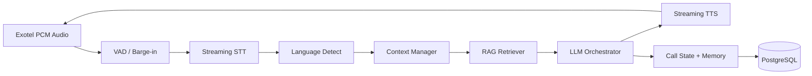

# Backend Architecture

Express + TypeScript layered architecture for the API, voice worker, and job processors.

## Request Flow

```
Route → Validator → Controller → Service → Repository → Prisma
```

## Cross-Cutting Concerns

| Concern | Implementation |
|---|---|
| Validation | Zod schemas (shared with frontend where possible) |
| Auth | JWT access + refresh tokens |
| Authorization | RBAC middleware |
| Events | EventEmitter (MVP) → Redis pub/sub (scale) |
| Errors | Centralized error handler |
| Audit | Audit log middleware on mutating routes |

## Module Structure

Each domain module contains:

```
modules/{domain}/
  {domain}.routes.ts
  {domain}.controller.ts
  {domain}.service.ts
  {domain}.repository.ts
  {domain}.validator.ts
  {domain}.dto.ts
```

Domains: `auth`, `users`, `campaigns`, `contacts`, `calls`, `knowledge`, `agents`, `analytics`, `settings`, `webhooks`

## Voice Conversation Pipeline



| Layer | Responsibility |
|---|---|
| STT | Partial transcripts, endpointing, language hint |
| Context Manager | Rolling window + structured call memory |
| RAG | Retrieve KB chunks + FAQs |
| LLM | Dynamic QA; function calling for lead qualification later |
| TTS | Sentence-chunk streaming; interrupt on barge-in |
| Barge-in | Stop TTS, clear buffer, process new utterance |

## Queue System (BullMQ)

| Queue | Purpose |
|---|---|
| `campaign-dialer` | Pick next contact, call Exotel Flow API |
| `call-retry` | Failed/busy/no-answer retries |
| `csv-import` | Parse, validate, dedupe contacts |
| `post-call` | Transcript cleanup, summary, sentiment |
| `recording-sync` | Fetch/store Exotel recordings |
| `analytics-rollup` | Aggregate campaign metrics |

## WebSocket Channels

| Channel | Protocol | Purpose |
|---|---|---|
| Exotel Voicebot | WSS (PCM JSON) | Real-time call audio |
| Admin live monitor | WSS | Supervisor dashboard |
| Internal events | Redis pub/sub | API ↔ admin gateway |

## Security

- JWT: 15m access + HTTP-only refresh cookie
- RBAC: permission matrix per route
- Tenant isolation: every query scoped by `organization_id`
- Webhooks: verify Exotel signature
- Input validation: Zod on all endpoints

## Scalability

- Voice workers: horizontal pods, state in Redis + DB
- Dialer: token bucket rate limit per org
- DB: Neon + read replica for analytics
- Caching: agent config + KB hot chunks in Redis (TTL 5 min)

## Related Docs

- [Folder Structure](./FOLDER-STRUCTURE.md)
- [API Endpoints](./API-ENDPOINTS.md)
- [Voice and AI](./VOICE-AND-AI.md)
- [Database Schema](./database/SCHEMA-REFERENCE.md)
