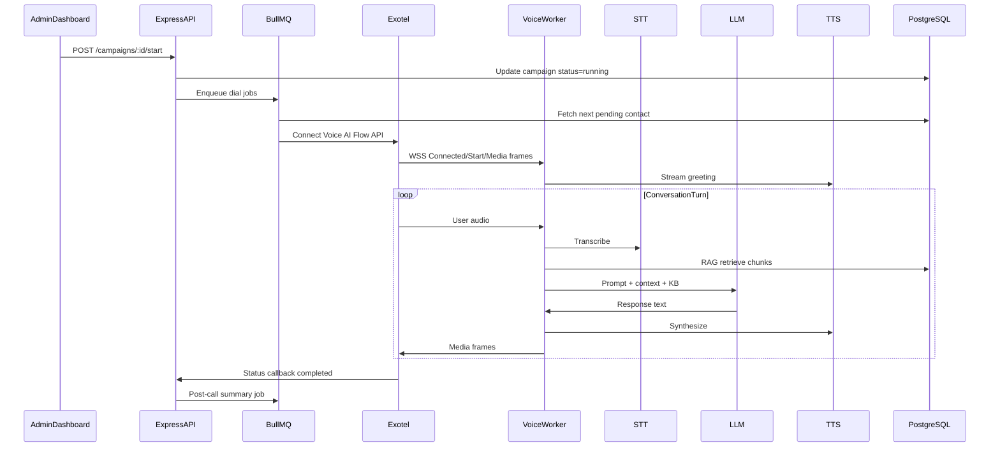
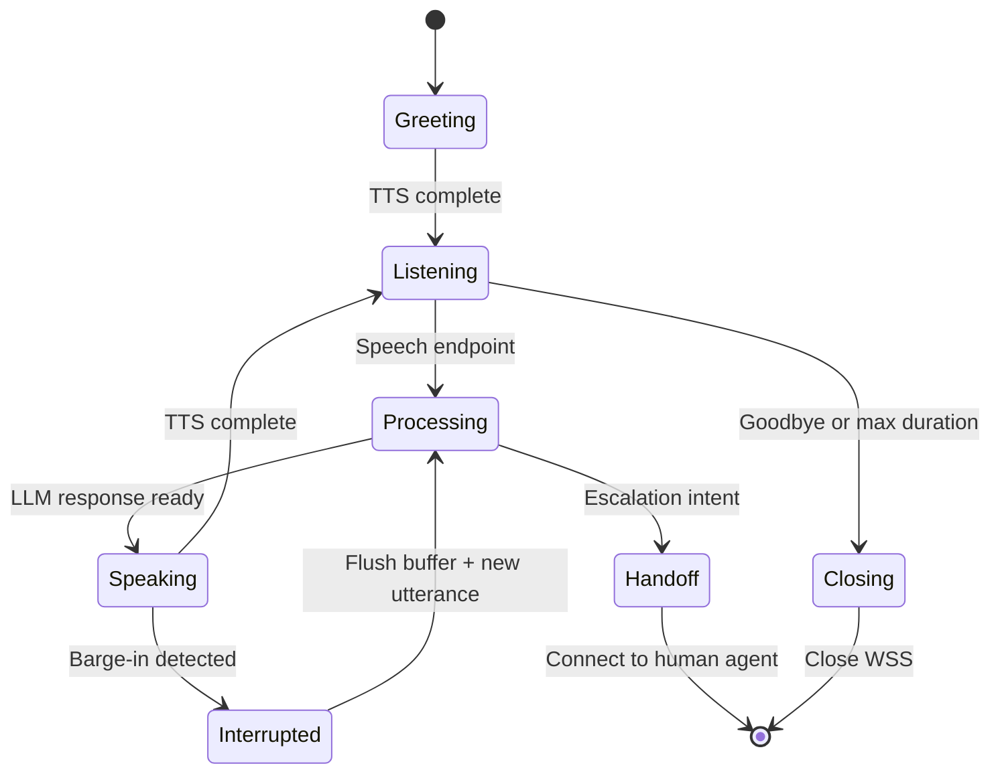
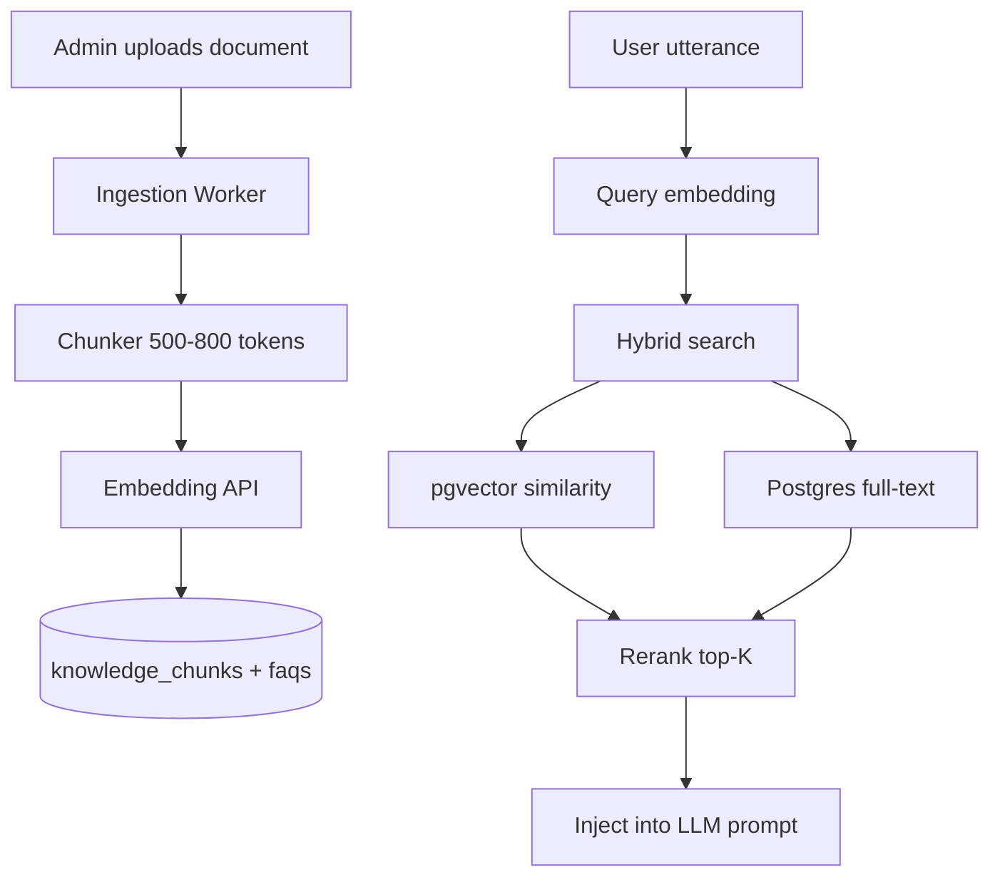

# Voice and AI Architecture

Backend voice pipeline, AI conversation, knowledge base, and multi-language support.

## Outbound Call Flow

## AI Conversation State Machine

## Prompt Layers

1. `system` — immutable rules
2. `agent` — tenant config from `ai_agents`
3. `campaign` — offer context
4. `retrieved_kb` — dynamic RAG chunks
5. `conversation_history` — rolling window

## Knowledge Base (RAG)

**Ingestion pipeline:**

1. Upload → S3 → queue job
2. Extract text (pdf-parse, mammoth)
3. Chunk with overlap
4. Embed via OpenAI text-embedding-3-small
5. Mark document `ready`

**FAQ fast path:** cosine similarity > 0.92 → return canned answer.

## Multi-Language Support

| Concern | Approach |
|---|---|
| Detection | STT auto-detect + LLM classifier on first utterance |
| Response | LLM replies in `detected_language` |
| TTS | Per-language voice map in `ai_agents.voice_profile` |
| KB | Tag chunks with language; fallback to English |
| Greetings | `greeting_script` JSONB: `{ "en": "...", "hi": "..." }` |

**Recommended providers (Indian languages):**

- STT: Deepgram nova-2 or Sarvam AI
- TTS: Google Cloud TTS, Azure Neural, or Sarvam
- LLM: GPT-4o mini or Claude with language-aware prompts

## Related Docs

- [AI Calling Phase 4](./AI-CALLING-PHASE-4.md) — detailed Phase 4 feature spec and implementation status
- [Backend Architecture](./ARCHITECTURE.md)
- [Database Schema](./database/SCHEMA-REFERENCE.md)
- [API Endpoints](./API-ENDPOINTS.md)
