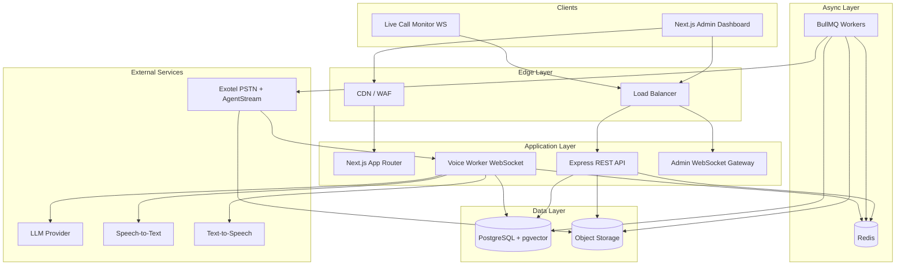
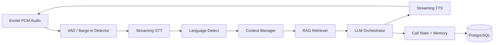
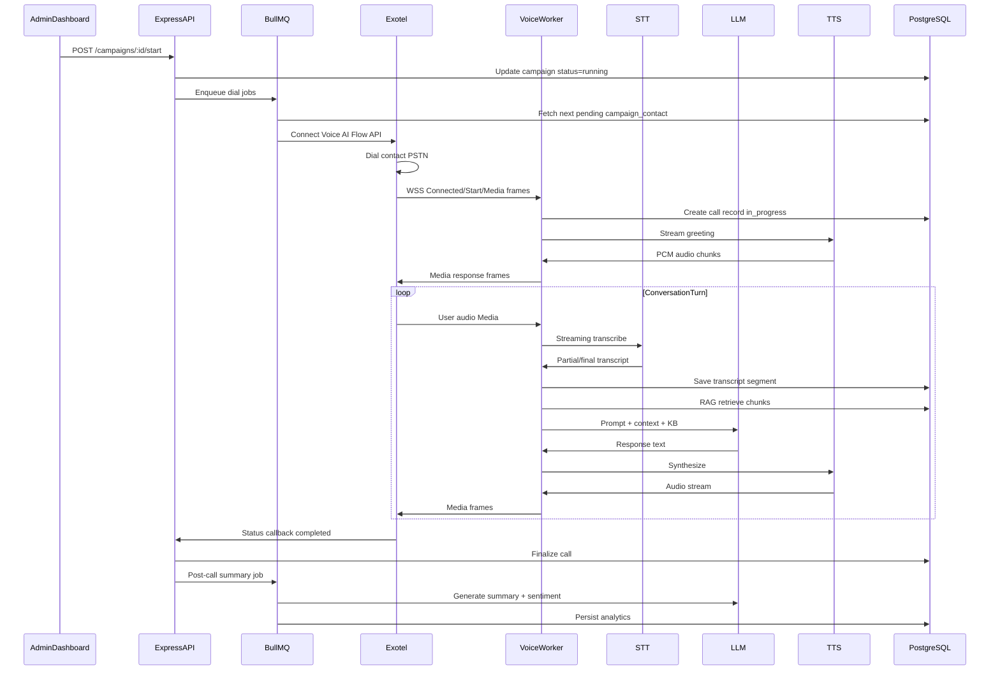
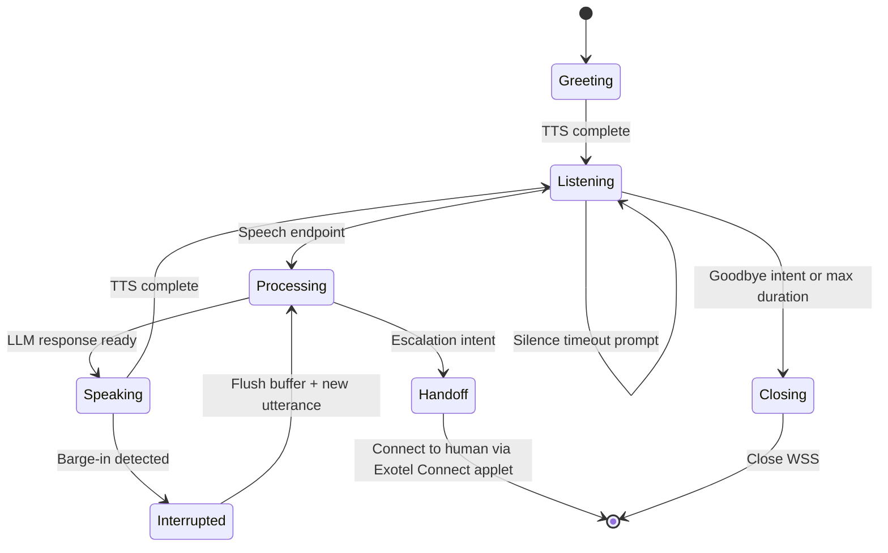
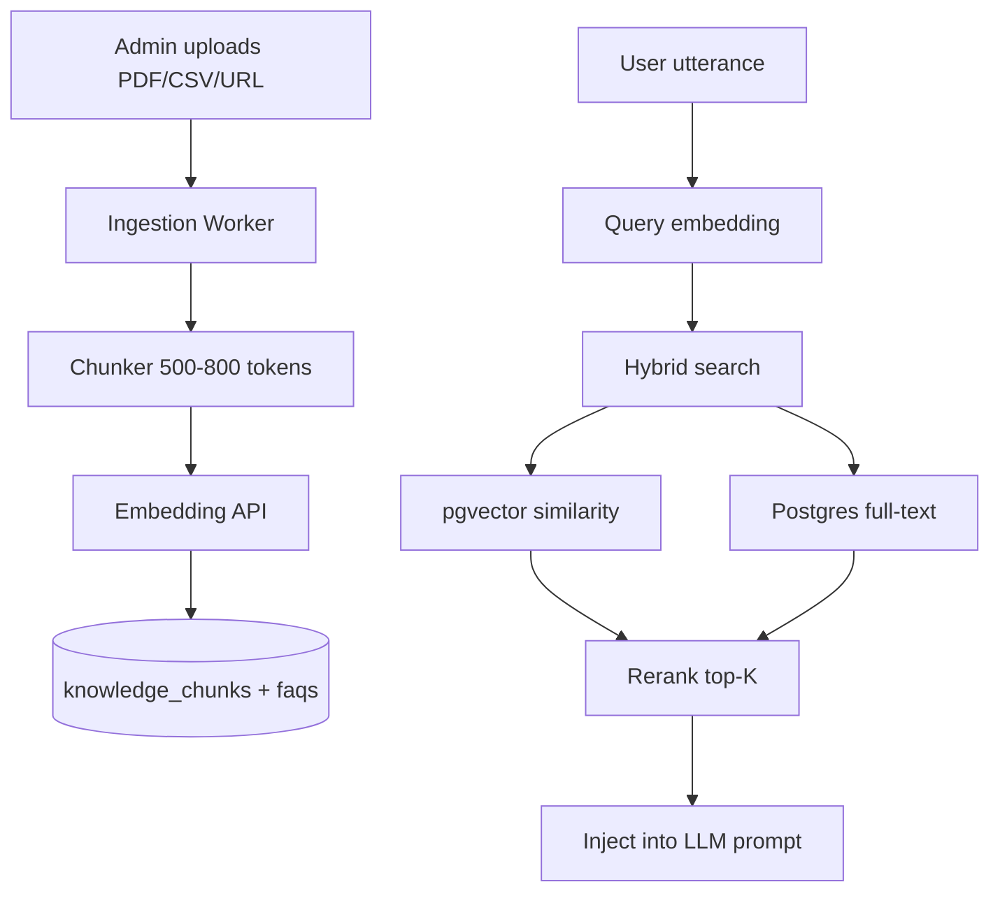
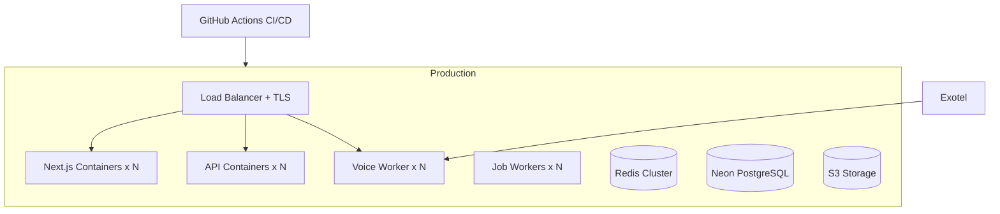

# AI Voice Calling Agent Platform — Technical Architecture

> **Note:** Documentation has been split by layer for clarity.
> - Backend: [docs/backend/README.md](../backend/README.md)
> - Frontend: [docs/frontend/README.md](../frontend/README.md)
> - Shared: [docs/shared/README.md](../shared/README.md)
>
> This file is kept as the complete reference copy of the original architecture document.

## Context and Key Decisions

This is a **greenfield** project. Architecture targets:

| Decision | Choice | Rationale |
|---|---|---|
| Telephony | **Exotel** (AgentStream Voicebot Applet) | India-focused PSTN, bidirectional WebSocket PCM streaming, outbound Flow API, DLT/compliance fit |
| Database | **PostgreSQL via Neon** (user wrote "NeoDB"; treat as PostgreSQL-compatible serverless Postgres) | Prisma-native, pgvector for RAG, branching for dev/staging |
| Real-time calls | **Dedicated Voice Worker service** (WebSocket server) | Express API cannot hold long-lived audio streams at scale; isolate latency-sensitive path |
| Job processing | **BullMQ + Redis** | Campaign dialing, retries, post-call enrichment, CSV imports |
| Knowledge retrieval | **pgvector + hybrid search** | Keeps stack simple; avoids extra vector DB in MVP |
| Auth | **JWT access + refresh tokens, RBAC** | Matches requirement; stateless API scaling |
| Deployment | **Cloud-agnostic** | Containerized services behind load balancer; managed Postgres + Redis |

---

## 1. High-Level System Architecture



**Service split (3 deployable units for production):**

1. **Web** — Next.js (SSR + dashboard)
2. **API** — Express REST + auth + campaign CRUD + webhooks
3. **Voice Worker** — Exotel WebSocket handler + conversation orchestrator
4. **Worker** — BullMQ consumers (dialer, imports, analytics, summaries)

---

## 2. Detailed Component Architecture

### 2.1 Frontend (Next.js App Router)

- **Feature-based modules**: `auth`, `campaigns`, `contacts`, `calls`, `knowledge`, `agents`, `analytics`, `settings`, `users`
- **Server Components** for static shells; **Client Components** for interactive tables/forms/charts
- **TanStack Query** for all server state; no global client store except UI ephemera (modal, sidebar)
- **Route groups**: `(auth)`, `(dashboard)`, `(public)`
- **Middleware**: JWT cookie check, role-based route guards

### 2.2 Backend (Express + TypeScript)

Layered architecture per domain:

```
Route → Validator → Controller → Service → Repository → Prisma
```

Cross-cutting:

- **Middleware**: `auth`, `rbac`, `rateLimit`, `requestId`, `errorHandler`, `auditLog`
- **DTOs**: Zod schemas shared with frontend where possible
- **Events**: in-process EventEmitter in MVP → Redis pub/sub at scale
- **Repositories**: Prisma queries only; no business logic

### 2.3 Voice Conversation Pipeline (Critical Path)



**Orchestration responsibilities:**

| Layer | Responsibility |
|---|---|
| STT | Partial transcripts, endpointing, language hint |
| Context Manager | Rolling window + structured call memory |
| RAG | Retrieve KB chunks + FAQs for current intent |
| LLM | Tool-free QA in MVP; function calling for lead qualification later |
| TTS | Sentence-chunk streaming; interrupt on barge-in |
| Barge-in | Stop TTS playback, clear audio buffer, process new utterance |

### 2.4 Queue System

| Queue | Purpose | Concurrency |
|---|---|---|
| `campaign-dialer` | Pick next contact, call Exotel Flow API | Rate-limited per tenant |
| `call-retry` | Failed/busy/no-answer retries | Exponential backoff |
| `csv-import` | Parse, validate, dedupe contacts | Batch inserts |
| `post-call` | Transcript cleanup, summary, sentiment | LLM batch |
| `recording-sync` | Fetch/store Exotel recordings | IO-bound |
| `analytics-rollup` | Aggregate campaign metrics | Scheduled |

### 2.5 WebSocket Architecture

| Channel | Protocol | Consumers |
|---|---|---|
| Exotel Voicebot | WSS (PCM JSON frames) | Voice Worker pods |
| Admin live monitor | WSS/Socket.io | Dashboard supervisors |
| Internal events | Redis pub/sub | API ↔ Admin WS gateway |

---

## 3. Complete Database Schema

**Note:** Use Prisma with PostgreSQL. Enable `pgvector` extension for embeddings.

### Core identity and RBAC

**users**
- `id` UUID PK
- `email` UNIQUE, `password_hash`, `first_name`, `last_name`, `phone`
- `organization_id` FK, `role_id` FK
- `is_active`, `email_verified_at`, `last_login_at`
- `created_at`, `updated_at`, `deleted_at` (soft delete)
- Indexes: `(organization_id)`, `(email)`, `(role_id)`

**roles**
- `id`, `name` UNIQUE (super_admin, org_admin, manager, agent, viewer)
- `description`, `is_system`

**permissions**
- `id`, `resource`, `action` — UNIQUE(resource, action)

**role_permissions**
- `role_id` FK, `permission_id` FK — composite PK

**organizations** (multi-tenant foundation)
- `id`, `name`, `slug` UNIQUE, `plan`, `settings` JSONB

### Campaigns and contacts

**campaigns**
- `id`, `organization_id` FK
- `name`, `description`, `status` (draft, scheduled, running, paused, stopped, completed)
- `ai_agent_id` FK, `knowledge_base_id` FK
- `caller_phone` (Exotel virtual number), `exotel_flow_url`
- `schedule_start`, `schedule_end`, `timezone`
- `max_concurrent_calls`, `retry_policy` JSONB
- `created_by` FK users
- Indexes: `(organization_id, status)`, `(schedule_start)`

**contacts**
- `id`, `organization_id` FK
- `phone` (E.164), `first_name`, `last_name`, `email`
- `metadata` JSONB, `opt_out` boolean
- UNIQUE(organization_id, phone)
- Indexes: `(organization_id)`, `(phone)`

**contact_tags**
- `id`, `organization_id`, `name` UNIQUE per org

**contact_tag_map**
- `contact_id`, `tag_id` — composite PK

**contact_groups**
- `id`, `organization_id`, `name`, `description`

**contact_group_map**
- `contact_id`, `group_id`

**contact_notes**
- `id`, `contact_id`, `author_id`, `note`, `created_at`

**campaign_contacts**
- `id`, `campaign_id`, `contact_id`
- `status` (pending, queued, dialing, connected, completed, failed, skipped)
- `attempt_count`, `last_attempt_at`, `next_retry_at`
- `lead_score`, `qualification` JSONB
- UNIQUE(campaign_id, contact_id)
- Indexes: `(campaign_id, status)`, `(next_retry_at)`

### Calls and media

**calls**
- `id`, `organization_id`, `campaign_id`, `contact_id`, `ai_agent_id`
- `exotel_call_sid` UNIQUE, `direction` (outbound)
- `status` (initiated, ringing, in_progress, completed, failed, busy, no_answer, canceled)
- `started_at`, `answered_at`, `ended_at`, `duration_seconds`
- `language_detected`, `sentiment` JSONB, `lead_qualified` boolean
- `summary` TEXT, `disposition` (interested, callback, not_interested, wrong_number)
- Indexes: `(campaign_id, status)`, `(contact_id)`, `(exotel_call_sid)`, `(started_at DESC)`

**call_recordings**
- `id`, `call_id` FK UNIQUE
- `storage_url`, `exotel_recording_url`, `duration_seconds`, `format`

**call_transcripts**
- `id`, `call_id` FK
- `speaker` (agent, user, system), `text`, `language`, `confidence`
- `start_ms`, `end_ms`, `sequence`
- Index: `(call_id, sequence)`

**call_logs** (technical/audit trail per call event)
- `id`, `call_id`, `event_type`, `payload` JSONB, `created_at`
- Index: `(call_id, created_at)`

**conversation_memory** (structured per-call memory for multi-turn)
- `id`, `call_id`, `key`, `value` JSONB, `updated_at`

### AI configuration

**ai_agents**
- `id`, `organization_id`
- `name`, `voice_profile` JSONB (TTS voice, speed, language defaults)
- `personality_prompt`, `greeting_script` JSONB (multi-lang)
- `interruption_enabled`, `max_silence_seconds`, `llm_config` JSONB
- `tools_enabled` JSONB (lead_qualification, callback_scheduling)

**knowledge_bases**
- `id`, `organization_id`, `name`, `description`, `default_language`

**knowledge_documents**
- `id`, `knowledge_base_id`
- `title`, `source_type` (upload, url, faq, manual)
- `raw_content`, `file_url`, `status` (processing, ready, failed)
- `metadata` JSONB

**knowledge_chunks**
- `id`, `document_id`, `content`, `embedding` vector(1536)
- `token_count`, `chunk_index`
- Index: IVFFlat/HNSW on embedding; `(document_id)`

**faqs**
- `id`, `knowledge_base_id`, `question`, `answer`, `language`, `embedding` vector(1536)

### Platform

**settings**
- `id`, `organization_id` FK UNIQUE
- `exotel_config` JSONB (encrypted refs), `default_caller_id`
- `notification_prefs`, `retention_days`, `feature_flags` JSONB

**audit_logs**
- `id`, `organization_id`, `user_id`, `action`, `resource_type`, `resource_id`
- `ip_address`, `user_agent`, `metadata` JSONB, `created_at`
- Index: `(organization_id, created_at DESC)`

**refresh_tokens**
- `id`, `user_id`, `token_hash`, `expires_at`, `revoked_at`

### Scalability notes

- Partition `call_logs` and `call_transcripts` by month at 10M+ rows
- Archive cold recordings to object storage lifecycle tiers
- Use read replica for analytics queries
- Batch insert campaign_contacts during CSV import (1000-row chunks)
- Connection pooling via PgBouncer / Neon pooler

---

## 4. Backend Folder Structure

```
backend/
├── src/
│   ├── app.ts
│   ├── server.ts
│   ├── config/
│   │   ├── env.ts
│   │   ├── database.ts
│   │   └── redis.ts
│   ├── modules/
│   │   ├── auth/
│   │   │   ├── auth.routes.ts
│   │   │   ├── auth.controller.ts
│   │   │   ├── auth.service.ts
│   │   │   ├── auth.repository.ts
│   │   │   ├── auth.validator.ts
│   │   │   └── auth.dto.ts
│   │   ├── users/
│   │   ├── campaigns/
│   │   ├── contacts/
│   │   ├── calls/
│   │   ├── knowledge/
│   │   ├── agents/
│   │   ├── analytics/
│   │   ├── settings/
│   │   └── webhooks/
│   │       └── exotel.webhook.controller.ts
│   ├── voice/
│   │   ├── ws-server.ts
│   │   ├── exotel-protocol.ts
│   │   ├── orchestrator/
│   │   │   ├── conversation-orchestrator.ts
│   │   │   ├── context-manager.ts
│   │   │   ├── barge-in-handler.ts
│   │   │   └── turn-state-machine.ts
│   │   └── adapters/
│   │       ├── stt/
│   │       ├── tts/
│   │       └── llm/
│   ├── jobs/
│   │   ├── queues.ts
│   │   ├── workers/
│   │   │   ├── campaign-dialer.worker.ts
│   │   │   ├── csv-import.worker.ts
│   │   │   ├── post-call.worker.ts
│   │   │   └── analytics.worker.ts
│   │   └── schedulers/
│   ├── events/
│   │   ├── event-bus.ts
│   │   └── handlers/
│   ├── middleware/
│   ├── shared/
│   │   ├── errors/
│   │   ├── utils/
│   │   └── constants/
│   └── prisma/
│       └── schema.prisma
├── tests/
├── Dockerfile
└── package.json
```

---

## 5. Frontend Folder Structure

```
frontend/
├── src/
│   ├── app/
│   │   ├── (auth)/
│   │   │   ├── login/page.tsx
│   │   │   ├── register/page.tsx
│   │   │   └── forgot-password/page.tsx
│   │   ├── (dashboard)/
│   │   │   ├── layout.tsx
│   │   │   ├── page.tsx                    # overview
│   │   │   ├── campaigns/
│   │   │   ├── contacts/
│   │   │   ├── calls/
│   │   │   ├── analytics/
│   │   │   ├── knowledge/
│   │   │   ├── agents/
│   │   │   ├── users/
│   │   │   └── settings/
│   │   ├── layout.tsx
│   │   └── providers.tsx
│   ├── features/
│   │   ├── auth/
│   │   ├── campaigns/
│   │   ├── contacts/
│   │   ├── calls/
│   │   ├── knowledge/
│   │   ├── agents/
│   │   ├── analytics/
│   │   └── settings/
│   │       ├── components/
│   │       ├── hooks/
│   │       ├── api/
│   │       ├── types/
│   │       └── utils/
│   ├── components/
│   │   ├── ui/                             # shadcn
│   │   ├── layout/
│   │   └── shared/
│   ├── lib/
│   │   ├── api-client.ts
│   │   ├── query-keys.ts
│   │   └── auth.ts
│   ├── hooks/
│   └── types/
├── public/
└── package.json
```

**React Query strategy:**
- Query keys: `['campaigns', orgId]`, `['campaign', id]`, `['calls', filters]`
- Mutations invalidate related lists
- Polling for active campaign stats (5–10s); WebSocket for live calls
- Prefetch on dashboard layout

---

## 6. API Endpoint List

Base: `/api/v1`

### Auth
- `POST /auth/register`
- `POST /auth/login`
- `POST /auth/refresh`
- `POST /auth/logout`
- `POST /auth/forgot-password`
- `POST /auth/reset-password`
- `GET /auth/me`

### Users and RBAC
- `GET /users` — list (admin)
- `POST /users` — invite/create
- `GET /users/:id`
- `PATCH /users/:id`
- `DELETE /users/:id`
- `GET /roles`
- `GET /permissions`

### Campaigns
- `GET /campaigns`
- `POST /campaigns`
- `GET /campaigns/:id`
- `PATCH /campaigns/:id`
- `DELETE /campaigns/:id`
- `POST /campaigns/:id/contacts/import`
- `POST /campaigns/:id/start`
- `POST /campaigns/:id/pause`
- `POST /campaigns/:id/stop`
- `GET /campaigns/:id/analytics`
- `GET /campaigns/:id/report`

### Contacts
- `GET /contacts`
- `POST /contacts`
- `GET /contacts/:id`
- `PATCH /contacts/:id`
- `DELETE /contacts/:id`
- `POST /contacts/import`
- `GET /contacts/export`
- `POST /contacts/:id/tags`
- `POST /contacts/:id/notes`
- `GET /groups`, `POST /groups`, etc.

### Calls
- `GET /calls`
- `GET /calls/:id`
- `GET /calls/:id/transcript`
- `GET /calls/:id/recording`
- `GET /calls/live` — active calls
- `WS /ws/calls/live` — supervisor monitor

### Knowledge Base
- `GET /knowledge-bases`
- `POST /knowledge-bases`
- `POST /knowledge-bases/:id/documents`
- `POST /knowledge-bases/:id/documents/upload`
- `GET /knowledge-bases/:id/documents`
- `DELETE /knowledge-documents/:id`
- `GET /knowledge-bases/:id/faqs`
- `POST /knowledge-bases/:id/faqs`
- `POST /knowledge-bases/:id/reindex`

### AI Agents
- `GET /agents`
- `POST /agents`
- `GET /agents/:id`
- `PATCH /agents/:id`
- `DELETE /agents/:id`
- `POST /agents/:id/test` — sandbox text conversation

### Analytics
- `GET /analytics/overview`
- `GET /analytics/calls`
- `GET /analytics/campaigns/:id`

### Settings
- `GET /settings`
- `PATCH /settings`

### Webhooks (Exotel)
- `POST /webhooks/exotel/status` — call status callbacks
- `POST /webhooks/exotel/passthru` — post-voicebot routing
- `GET /webhooks/exotel/passthru` — escalation decision

### Health
- `GET /health`, `GET /ready`

---

## 7. Sequence Diagram — Outbound Call Flow



---

## 8. AI Conversation Flow



**Prompt management system:**
- Store templates in DB (`ai_agents.personality_prompt`) + versioned files in repo for system prompts
- Layers: `system` (immutable rules) → `agent` (tenant config) → `campaign` (offer context) → `retrieved_kb` (dynamic) → `conversation_history` (rolling)
- Guardrails: max tokens, blocked topics, PII redaction in logs

**Lead qualification (post-MVP):**
- LLM extracts structured fields → `campaign_contacts.qualification` JSONB
- Scoring rules per campaign

---

## 9. Knowledge Base Architecture



**Ingestion pipeline:**
1. Upload → S3 → job queued
2. Extract text (pdf-parse, mammoth for docx)
3. Chunk with overlap
4. Embed via OpenAI/Cohere/local model
5. Mark document `ready`

**FAQ fast path:** If cosine similarity > 0.92 against FAQ embedding, return canned answer (lower latency + cost).

---

## 10. Multi-Language Architecture

| Concern | Approach |
|---|---|
| Detection | STT language auto-detect + lightweight LLM classifier on first utterance |
| Response language | LLM instructed to reply in `detected_language`; agent default fallback |
| TTS voice | Per-language voice map in `ai_agents.voice_profile` |
| KB content | Tag chunks with `language`; retrieve within detected language first, fallback to English |
| Scripts | `greeting_script` JSONB: `{ "en": "...", "hi": "...", "ta": "..." }` |
| Exotel | Single flow; language handled entirely in bot layer |

**Recommended providers for Indian languages:**
- STT: Deepgram nova-2 (multi) or Sarvam AI (hi/regional)
- TTS: Google Cloud TTS, Azure Neural, or Sarvam
- LLM: GPT-4o mini (cost) / Claude (quality) with language-aware system prompt

---

## 11. Scalability Design

**Targets:** 100K+ contacts, thousands of concurrent calls

| Layer | Strategy |
|---|---|
| Dialer | Token bucket rate limit per org + Exotel account limits |
| Voice workers | Horizontal pods; sticky routing not required (state in Redis + DB) |
| Redis | Cluster mode; separate instances for queue vs pub/sub vs session cache |
| DB | Neon scale + read replica; index campaign_contact queue queries |
| Storage | S3-compatible for recordings/transcripts export |
| Caching | Agent config + KB hot chunks in Redis (TTL 5 min) |

**Rate limiting:** API Gateway or Express rate-limit (100 req/min auth, 10 req/min webhooks)

**Monitoring:** OpenTelemetry traces across API → Voice Worker; Prometheus metrics (`call_latency`, `stt_ttfb`, `llm_tokens`, `queue_depth`)

---

## 12. Security

- **JWT:** Short-lived access (15m) + HTTP-only refresh cookie; rotate on refresh
- **RBAC:** Middleware checks `permission` matrix per route
- **Secrets:** Vault or cloud secret manager; never store Exotel credentials in DB plaintext
- **Input validation:** Zod on all endpoints; CSV injection sanitization
- **File uploads:** MIME whitelist, size cap, virus scan hook, store outside web root
- **Audit logs:** All mutating admin actions
- **Webhooks:** Verify Exotel signature / shared secret
- **Tenant isolation:** Every query scoped by `organization_id`
- **PII:** Encrypt phone at rest optional; mask in UI; retention policy in settings

---

## 13. Deployment Architecture (Cloud-Agnostic)



**Recommended default stack (flexible):**
- Frontend: Vercel or containerized Next.js
- API/Workers: Fly.io, Railway, AWS ECS, or GCP Cloud Run
- DB: Neon PostgreSQL
- Redis: Upstash or ElastiCache
- Storage: AWS S3 / Cloudflare R2

**Environments:** dev → staging → prod with Neon branches

---

## 14. Recommended Open-Source Tools and Integrations

| Category | Tool |
|---|---|
| Telephony | Exotel AgentStream + Flow API |
| ORM | Prisma |
| Queue | BullMQ |
| Validation | Zod |
| Auth crypto | bcrypt + jsonwebtoken |
| STT | Deepgram SDK (primary), Vosk (fallback/offline) |
| TTS | Coqui / edge-tts (dev), cloud TTS (prod) |
| LLM | OpenAI / Anthropic via adapter interface |
| Embeddings | OpenAI text-embedding-3-small |
| Vector | pgvector |
| WebSocket | ws (Node) |
| Logging | Pino |
| Metrics | Prometheus + Grafana |
| Error tracking | Sentry |
| Email | Resend / Nodemailer + SMTP |
| CI/CD | GitHub Actions |
| IaC | Terraform or Pulumi (optional) |

---

## 15. Development Phases and Roadmaps

### Phase 0 — Foundation (Week 1–2)
- Monorepo scaffold (`frontend/`, `backend/`, shared types)
- Prisma schema + migrations
- Auth (register, login, JWT, RBAC seed)
- Docker Compose for local Postgres + Redis

### MVP Roadmap (Week 3–10) — Ship usable product

| Sprint | Deliverable |
|---|---|
| M1 | Dashboard shell, user management, settings |
| M2 | Contacts CRUD, CSV import, tags/groups |
| M3 | Knowledge base upload, chunking, FAQ, basic RAG |
| M4 | AI agent config, prompt templates |
| M5 | Campaign CRUD, schedule, Exotel integration (single call test) |
| M6 | Voice Worker: STT → LLM → TTS loop with Exotel Voicebot |
| M7 | Campaign dialer queue, retry logic, call history |
| M8 | Transcripts, recordings, call summaries, basic analytics |

**MVP success criteria:**
- Admin creates campaign with 100 contacts
- AI places outbound calls via Exotel
- Multi-turn Hindi/English conversation with KB answers
- Barge-in works
- Dashboard shows call outcomes

### Production Roadmap (Week 11–24)

| Phase | Focus |
|---|---|
| P1 | Live call monitoring WebSocket, supervisor dashboard |
| P2 | Sentiment analysis, lead qualification, advanced analytics |
| P3 | Multi-tenant hardening, audit logs, rate limits |
| P4 | Horizontal scaling, load tests (1K concurrent calls) |
| P5 | HA deployment, observability, runbooks, backup/DR |
| P6 | Billing/plans, API keys, webhooks for customers |

---

## 16. Implementation Order (Step-by-Step)

1. Initialize monorepo and CI
2. Design Prisma schema (all tables above) and seed roles/permissions
3. Build auth + org multi-tenancy
4. Build contact and campaign APIs
5. Build knowledge ingestion + pgvector RAG
6. Build AI adapter interfaces (LLM, STT, TTS)
7. Build Voice Worker with Exotel protocol handler
8. Implement conversation orchestrator + barge-in
9. Wire campaign dialer worker to Exotel Flow API
10. Add webhooks for call status + passthru handoff
11. Build frontend feature modules against API
12. Add post-call pipeline (summary, sentiment)
13. Load test and tune concurrency limits
14. Production deploy with monitoring

---

## 17. Risk Register

| Risk | Mitigation |
|---|---|
| Exotel rate/account limits | Queue-based dialer with per-org caps |
| STT/TTS latency | Streaming pipeline, FAQ short-circuit, regional provider |
| LLM hallucination | RAG-only answers policy + confidence threshold + fallback script |
| Concurrent call scale | Separate voice worker autoscaling from API |
| DLT/TRAI compliance (India) | Opt-out flags, calling windows, registered templates |

---

## Monorepo Layout (Recommended Root)

```
Calling/
├── frontend/          # Next.js
├── backend/           # Express API
├── voice-worker/      # Exotel WSS service (can merge into backend initially)
├── workers/           # BullMQ workers (can merge into backend initially)
├── packages/
│   └── shared/        # Zod schemas, types, constants
├── docker-compose.yml
├── .github/workflows/
└── README.md
```

**MVP simplification:** Start with `backend/` containing API + voice + jobs in one repo folder; split into separate services when approaching ~100 concurrent calls.
