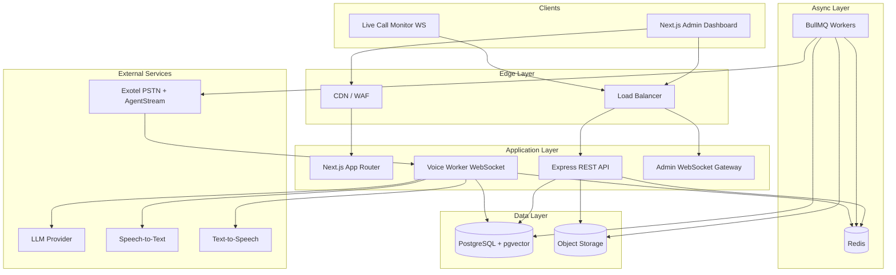
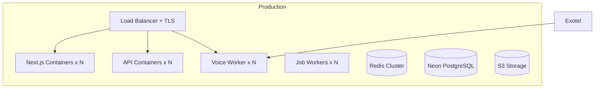

# System Architecture

High-level architecture spanning frontend, backend, and infrastructure.

## Key Decisions

| Decision | Choice | Rationale |
|---|---|---|
| Telephony | Exotel AgentStream | India PSTN, bidirectional WebSocket, DLT compliance |
| Database | PostgreSQL (Neon) + pgvector | Prisma-native, RAG embeddings, branching |
| Real-time calls | Dedicated Voice Worker | Isolate latency-sensitive audio streams |
| Job processing | BullMQ + Redis | Dialer, retries, imports, post-call jobs |
| Auth | JWT + refresh + RBAC | Stateless API scaling |
| Deployment | Cloud-agnostic containers | Flexible hosting |

## System Diagram



## Deployable Services

| Service | Technology | Docs |
|---|---|---|
| Web | Next.js | [Frontend](../frontend/README.md) |
| API | Express REST | [Backend](../backend/README.md) |
| Voice Worker | WebSocket + AI pipeline | [Voice and AI](../backend/VOICE-AND-AI.md) |
| Workers | BullMQ consumers | [Backend Architecture](../backend/ARCHITECTURE.md) |

## Deployment Architecture



**Recommended stack:**

- Frontend: Vercel or containerized Next.js
- API/Workers: Fly.io, Railway, AWS ECS, or GCP Cloud Run
- DB: Neon PostgreSQL
- Redis: Upstash or ElastiCache
- Storage: AWS S3 / Cloudflare R2

## Development Roadmap

### Phase 0 — Foundation
- Monorepo scaffold, Prisma schema, Docker Compose

### MVP (Weeks 3–10)

| Sprint | Backend | Frontend |
|---|---|---|
| M1 | Auth API, users | Dashboard shell, settings |
| M2 | Contacts API, CSV import | Contacts CRUD, tags |
| M3 | Knowledge base, RAG | KB upload, FAQ management |
| M4 | AI agent config | Agent configuration UI |
| M5 | Campaign CRUD, Exotel | Campaign management |
| M6 | Voice Worker pipeline | Call monitoring |
| M7 | Dialer queue, retries | Call history |
| M8 | Post-call analytics | Analytics dashboard |

### Production (Weeks 11–24)

- Live call monitoring WebSocket
- Sentiment analysis, lead qualification
- Multi-tenant hardening, audit logs
- Horizontal scaling, load tests
- HA deployment, observability
- Billing/plans, API keys

## Implementation Order

1. ~~Prisma schema + seed~~ (Phase 1 complete)
2. Auth + org multi-tenancy API
3. Contact and campaign APIs
4. Knowledge ingestion + pgvector RAG
5. AI adapter interfaces (LLM, STT, TTS)
6. Voice Worker + Exotel protocol
7. Campaign dialer worker
8. Webhooks for call status
9. Frontend feature modules
10. Post-call pipeline
11. Load test and production deploy

## Risk Register

| Risk | Mitigation |
|---|---|
| Exotel rate limits | Queue-based dialer with per-org caps |
| STT/TTS latency | Streaming pipeline, FAQ short-circuit |
| LLM hallucination | RAG-only policy + confidence threshold |
| Concurrent call scale | Separate voice worker autoscaling |
| DLT/TRAI compliance | Opt-out flags, calling windows, registered templates |

## Monorepo Layout

```
Calling/
├── docs/
│   ├── backend/       # Backend docs
│   ├── frontend/      # Frontend docs
│   └── shared/        # This folder
├── frontend/          # Next.js (Phase 3)
├── backend/           # Express API (Phase 2)
├── packages/shared/   # Shared Zod schemas
├── docker-compose.yml
└── README.md
```

## Related Docs

- [Project Overview](./PROJECT-OVERVIEW.md)
- [Full Architecture Reference](./FULL-ARCHITECTURE-REFERENCE.md)
- [Backend README](../backend/README.md)
- [Frontend README](../frontend/README.md)
